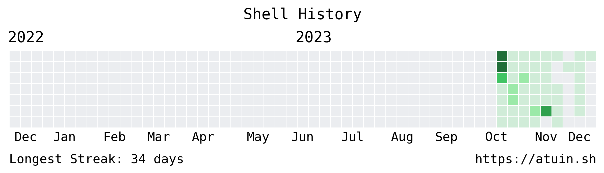

## Hi there 👋

 

## GitHub Stats

These infographics were generated using [lowlighter/metrics](https://github.com/lowlighter/metrics)

Courtesy of [atuinsh/atuin](https://github.com/atuinsh/atuin)
